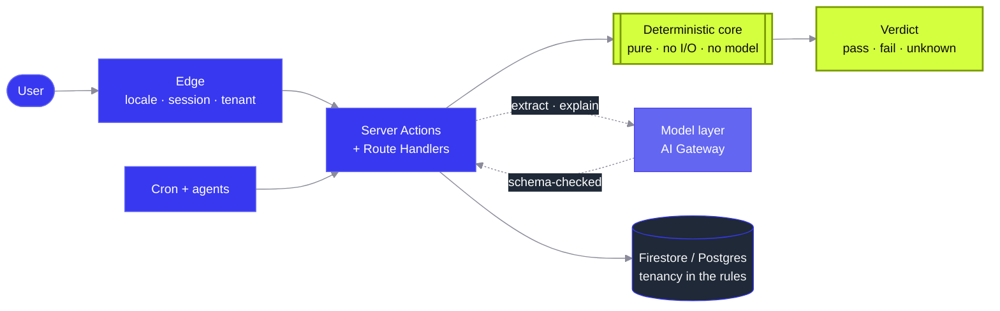

<picture>
  <source media="(prefers-color-scheme: dark)" srcset="https://raw.githubusercontent.com/KadonWills/kadonwills/main/assets/header-dark.svg">
  <source media="(prefers-color-scheme: light)" srcset="https://raw.githubusercontent.com/KadonWills/kadonwills/main/assets/header-light.svg">
  
</picture>

 

 

 

---

> **Technology should fundamentally improve how we live and work, not add noise.**

## 👋 The 30-second version

I'm **Brondon Wills** — most people call me **Kadon**. Software engineer, and founder of **[Dinovix Ltd.](https://www.dinovix.com)**

The hardest part of building the future isn't writing the code — it's aligning technical velocity with a modern business mindset to create products that actually scale. Over seven years I've helped startups and SMEs across **Cameroon, the US, Switzerland, Germany and the UK** turn intricate problems into web and mobile products: fintech ledgers, high-traffic commerce, design systems, and corporate systems nobody is allowed to break.

These days I mostly build **AI products where the model is a component, not the architecture** — and I ship them end to end, from the Firestore rules to the pricing page.

 

## 🚀 Shipping now

> These are commercial products, so most of the source is private. **Links go to the live product, not the repo.**

<table>
<tr>
<td width="50%" valign="top">

### 🛰 [Fursa](https://www.fursa.space)
**The path, verified.**

Matches a real profile against official immigration rules and ranks the routes actually open to it — every figure sourced, dated, and priced in the applicant's own currency.

`Next.js 16` `Firebase Vector` `MCP` `EN / FR`

**The hard part:** eligibility is computed in tested, auditable code — never by a model. `unknown` is a first-class verdict that never degrades into `fail`. Import boundaries around the pure core are enforced in CI, not in code review.

`106 programmes` · `33 origin countries` · `31 test suites`

</td>
<td width="50%" valign="top">

### ✍️ [ProPost AI](https://www.propost-ai.online)
**One post a day, in your voice, approved by you.**

Drafts a LinkedIn post daily in the user's own tone, schedules it against their own analytics, and publishes nothing without an explicit approval step.

`Auth.js v5` `AI Gateway` `Firestore` `LinkedIn OAuth`

**The hard part:** two-stage OAuth with AES-256-GCM token encryption at rest, and a plan-gated model picker that re-validates **server-side** — so a client can never force a tier it hasn't paid for.

`365 drafts/user/year` · `0 posts published unapproved`

</td>
</tr>
<tr>
<td width="50%" valign="top">

### 📡 [Busidea Radar](https://busidea-radar.vercel.app)
**Opportunity research, on a schedule.**

Researches four business opportunities across three markets, dedupes against the last 90 days, and emails a digest with conviction scores and buyer personas.

`Claude web search` `Vercel Blob` `NDJSON streaming`

**The hard part:** cost-aware two-stage dedup — a free keyword fingerprint settles the obvious pairs, and only genuinely borderline ones escalate to a single *batched* LLM verdict.

`~$0.85 per run` · `tracked per model on the dashboard`

</td>
<td width="50%" valign="top">

### 🛵 Delivr &nbsp;`pre-launch`
**One engine. Delivery, rides and parcels.**

A single *Job* primitive — a driver moved through a sequence of stops — powering three verticals and four role-based portals on one logistics core.

`Multi-tenant` `Geohash dispatch` `Firestore rules`

**The hard part:** `companyId` isolation is enforced in the security rules *and* re-checked server-side on every route. One service layer feeds both the cookie-session web API and the bearer-token mobile API, so tenancy can't drift between them.

`52 route handlers` · `19 test suites`

</td>
</tr>
</table>

**Also in flight**

| | What it does | The interesting bit | Status |
|---|---|---|---|
| **MBOKAM** | Turns a Cameroonian merchant's WhatsApp number into a real shop | Four-layer multi-tenancy down to **Postgres RLS**; custom ESLint rules that ban the admin client outside `lib/db/*` | Pre-launch |
| **Baobab** | A family tree in 3D that relatives claim and extend themselves | `react-three-fiber` kinship + layout engine; living people private by default; invites are Admin-SDK-only | Early |
| **Job Hunter** | 15 scored roles in your inbox at 08:00, each with a written intro | ~150 ATS endpoints across 6 providers, and a "remote lie detector" that reads work-authorisation locks instead of trusting the word *Remote* | Private beta |
| **sysprobe** | What's eating your CPU, disk and battery — right now | Rust workspace: one shared core, two front-ends (CLI + Tauri v2). Trashes, never deletes | Tool |

 

## 🏛 How I build

The same shape shows up in almost everything above. The single rule it's organised around:

> ### Models extract and explain. Deterministic code decides.

A model is allowed to read a government PDF and tell me what it says. It is never allowed to decide whether you qualify. That boundary is what makes the output auditable — and it's why the core of these products is a pure, fully-tested module that imports nothing but a schema library and a date library.

 

## 📐 Four things I've stopped arguing about

- **Scope is the real architecture decision.** Most "architecture problems" are unbounded scope wearing a costume.
- **Regulated work sets the floor.** Once you've shipped in fintech and public sector, that becomes the baseline everywhere else.
- **Components are a contract.** A design system nobody documents is just a folder.
- **Empathetic technical leadership.** Leading remote teams across three time zones taught me async clarity beats synchronous heroics — written decisions, visible reasoning, no ambient context.

 

## 🧰 Stack

*Tools chosen for the job, not the résumé.*

<!-- Commas below are %2C-encoded on purpose: a raw comma inside srcset is a
     candidate separator, so the browser would request only the first icon. -->
<picture>
  <source media="(prefers-color-scheme: dark)" srcset="https://skillicons.dev/icons?i=ts%2Cnextjs%2Creact%2Ctailwind%2Cnodejs%2Cjava%2Cspring%2Cflutter%2Cdart%2Cfirebase%2Cpostgres%2Cdocker%2Crust%2Cvercel%2Cgit%2Cfigma&theme=dark&perline=8">
  <source media="(prefers-color-scheme: light)" srcset="https://skillicons.dev/icons?i=ts%2Cnextjs%2Creact%2Ctailwind%2Cnodejs%2Cjava%2Cspring%2Cflutter%2Cdart%2Cfirebase%2Cpostgres%2Cdocker%2Crust%2Cvercel%2Cgit%2Cfigma&theme=light&perline=8">
  
</picture>

<b>The full inventory</b>

 

| Layer | | |
|---|---|---|
| **Languages** | *Daily drivers* | Java · JavaScript (ES6) · TypeScript · Dart · SQL |
| **Backend** | *Where the rules live* | Spring Boot · Spring Cloud · Spring Security · Spring REST · Microservices · Laravel · Node.js |
| **Frontend** | *Product surface* | React · Next.js · Redux · Inertia · Tailwind CSS · MUI · Ant Design · Styled Components · Motion |
| **Mobile** | *Cross-platform* | Flutter · Dart |
| **Data** | *Persistence* | PostgreSQL · MySQL · Oracle · Firebase · Strapi |
| **AI** | *Model layer* | Vercel AI SDK · AI Gateway · Anthropic SDK · MCP · structured output with schema validation |
| **Tooling** | *How the work ships* | Git · Docker · GitHub Actions · Maven · Webpack · Swagger · Storybook · Chromatic · Cloudflare · Stripe · Figma · Agile |

 

## 📊 Public footprint

<picture>
  <source media="(prefers-color-scheme: dark)" srcset="https://github-profile-summary-cards.vercel.app/api/cards/repos-per-language?username=KadonWills&theme=github_dark">
  <source media="(prefers-color-scheme: light)" srcset="https://github-profile-summary-cards.vercel.app/api/cards/repos-per-language?username=KadonWills&theme=default">
  
</picture>
<picture>
  <source media="(prefers-color-scheme: dark)" srcset="https://github-profile-summary-cards.vercel.app/api/cards/most-commit-language?username=KadonWills&theme=github_dark">
  <source media="(prefers-color-scheme: light)" srcset="https://github-profile-summary-cards.vercel.app/api/cards/most-commit-language?username=KadonWills&theme=default">
  
</picture>

  

<picture>
  <source media="(prefers-color-scheme: dark)" srcset="https://raw.githubusercontent.com/KadonWills/kadonwills/output/snake-dark.svg">
  <source media="(prefers-color-scheme: light)" srcset="https://raw.githubusercontent.com/KadonWills/kadonwills/output/snake.svg">
  
</picture>

<b>Read this chart with an asterisk.</b> The products above live in private repos, so the public slice skews toward older, open work — it's a floor, not a ceiling.

 

## 🌍 Selected client work

Client names are under NDA, so here are the outcomes instead.

| Domain | What it was | Outcome |
|---|---|---|
| **Fintech** | Rebuilt a payments backend that was losing customers to slow, unreliable transaction handling | **−30%** response times · **−40%** downtime · 100% client satisfaction |
| **Public sector** | End-to-end automated federal tax return platform, compliance logic isolated from presentation | **99%** calculation accuracy · **−25%** processing time |
| **Design systems** | Atomic component library, Figma handoff through to documented, visually-tested release | Visual regressions in production eliminated · full documentation coverage |
| **SaaS** | Digitised shift management that previously ran on paper and messaging apps | Delivered in a single quarter |

 

## 🎓 Beyond the code

- **Certified** — Meta Front-End Developer (2024) · Google Africa Developer Training (2021)
- **Studied** — BSc Computer Science, Software Engineering — African Institute of Computer Science, Cameroon
- **Give back** — Co-founder, Bio Foundation · Contributor, Open Source Cameroon · Mentor, Code4Africa
- **Speak** — French and English (bilingual) · Chinese and Russian (basics)

 

---

## 🤝 Let's build something

**Open to select engagements** — fractional CTO, MVP sprints, product-lifecycle consulting, and technical due diligence. 
I reply within two working days.

  

  

***"Great code, like great art, leaves an indelible mark on the world."***

